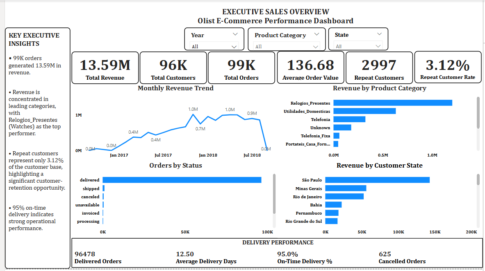
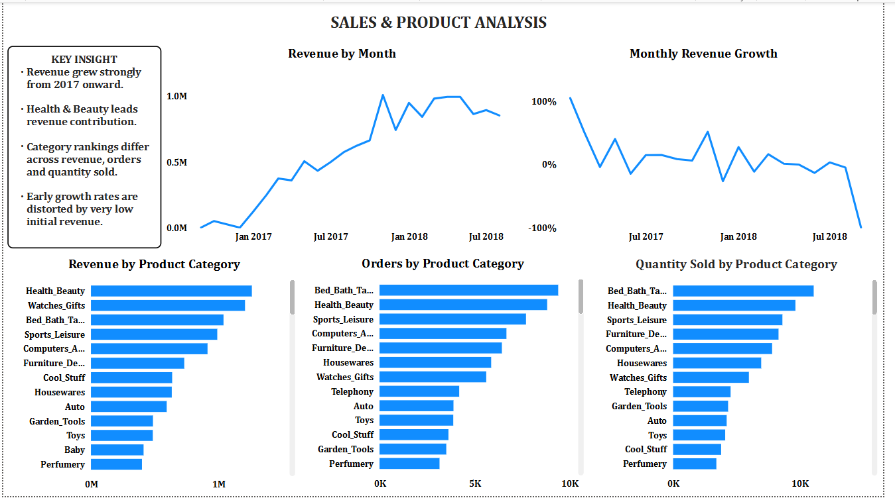
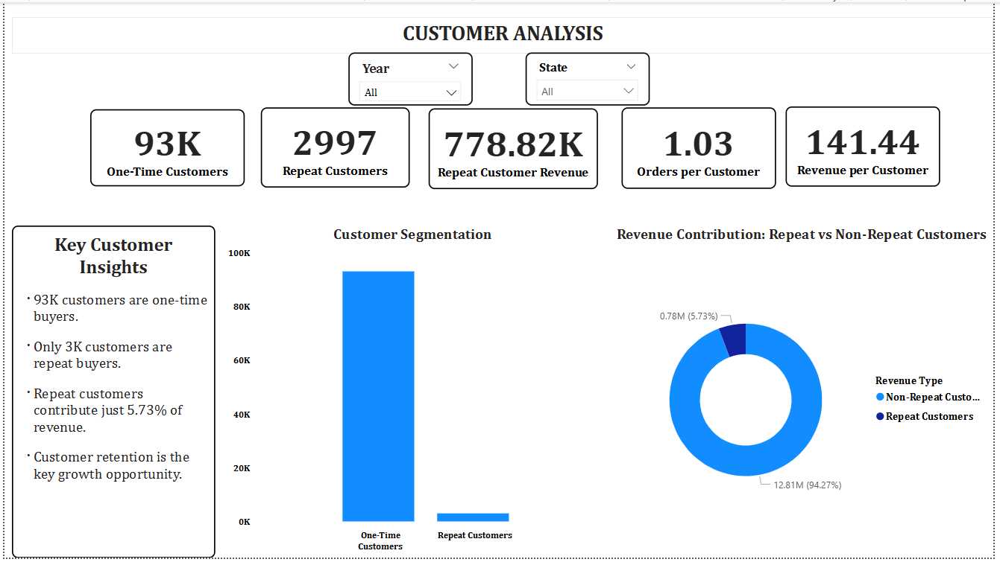
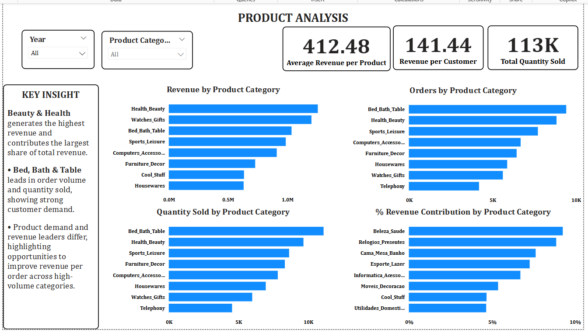
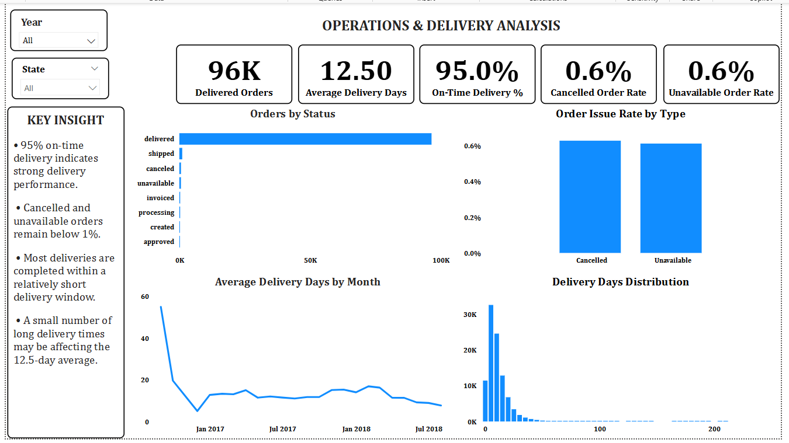

# Olist E-Commerce Intelligence Dashboard

#Project Overview#
This project is an end-to-end *Business Intelligence and Data Analytics project* built using Power BI to analyse the performance of Olist, a Brazilian e-commerce marketplace.

The dashboard transforms raw e-commerce data into actionable business insights across four key areas:
* Sales Performance
* Customer Behaviour
* Product Performance
* Operations & Delivery Performance

The final solution consists of an interactive Power BI dashboard with an executive overview and dedicated analytical pages designed to help stakeholders understand business performance, identify growth opportunities, and monitor operational efficiency.

---

## Business Problem
E-commerce businesses generate large volumes of transactional, customer, product, and delivery data. However, raw data alone does not provide clear answers to important business questions.

This project addresses questions such as:
* How is revenue performing over time?
* Which product categories generate the most revenue?
* Which categories receive the highest number of orders?
* How many customers are new, one-time, or repeat customers?
* How much revenue is generated by repeat customers?
* What opportunities exist to improve customer retention?
* Which product categories have the highest sales volume?
* How efficient is the order fulfilment and delivery process?
* What percentage of orders are delivered on time?
* How significant are cancelled and unavailable orders?
* Are a small number of delayed deliveries affecting average delivery performance?

The objective was to build a centralised dashboard that converts this data into meaningful and actionable insights.

---

## Dataset
The project uses the *Olist Brazilian E-Commerce Dataset*, containing transactional data from a Brazilian online marketplace.

The dataset includes information relating to:
* Customers
* Orders
* Order items
* Products
* Sellers
* Payments
* Customer reviews
* Geolocation
* Order delivery and fulfilment

### Key Tables Used
| Table                          | Description                          |
| ------------------------------ | ------------------------------------ |
| `olist_orders_dataset`         | Order and order status information   |
| `olist_customers_dataset`      | Customer information and location    |
| `olist_order_items_dataset`    | Products purchased within each order |
| `olist_products_dataset`       | Product and category information     |
| `olist_order_payments_dataset` | Order payment information            |
| `olist_order_reviews_dataset`  | Customer review information          |
| `olist_sellers_dataset`        | Seller information                   |
| `olist_geolocation_dataset`    | Geographic location data             |

---

# Tools & Technologies
The following tools were used throughout this project:

### Power BI

Used for:
* Data modelling
* Dashboard development
* Data visualisation
* Interactive reporting

### Power Query

Used for:
* Data cleaning
* Data transformation
* Handling missing values
* Data profiling
* Data preparation

### DAX
Used to create business measures and KPIs, including:

* Total Revenue
* Total Orders
* Total Customers
* Revenue Growth
* Previous Month Revenue
* Repeat Customers
* New Customers
* Delivery Performance Metrics
* Order Issue Rates

### Excel / SQLite

Used for data access and preparation during the project workflow.

---

# Data Preparation & Transformation
The dataset was cleaned and prepared using Power Query before analysis.

Key preparation activities included:

* Reviewing data types
* Identifying missing values
* Handling incomplete product category information
* Investigating duplicate records
* Standardising data where required
* Creating relationships between fact and dimension tables
* Creating a dedicated calendar table for time-based analysis
* Creating additional calculated fields required for delivery analysis

The data was then modelled in Power BI to support cross-table analysis and interactive reporting.

---

# Data Model
The Power BI model was structured around the core e-commerce business entities.

The primary analytical relationships connect:
* Customers to Orders
* Orders to Order Items
* Order Items to Products
* Orders to Payments
* Orders to Reviews
* Order Items to Sellers
* Calendar to Orders

A dedicated **Calendar table** was created to support:
* Monthly revenue analysis
* Revenue growth calculations
* Previous month comparisons
* Time-based filtering

---

# Key KPIs Created

The project includes a range of measures designed to monitor business performance.

## Sales KPIs
* Total Revenue
* Total Orders
* Total Customers
* Average Order Value
* Total Quantity Sold
* Revenue per Customer
* Previous Month Revenue
* Revenue Growth %

## Customer KPIs
* One-Time Customers
* New Customers
* Repeat Customers
* Repeat Customer Rate
* Repeat Customer Revenue
* Non-Repeat Customer Revenue
* Orders per Customer
* Revenue per Customer

## Product KPIs
* Average Revenue per Product
* Total Quantity Sold
* Category Revenue Contribution %

## Operations & Delivery KPIs
* Delivered Orders
* Average Delivery Days
* On-Time Delivery %
* Cancelled Orders
* Cancelled Order Rate
* Unavailable Order Rate

---

# Dashboard Pages
## 1. Cover Page

The project begins with a portfolio-style landing page introducing the dashboard and providing an overview of the analytical areas covered.

**Analysis Areas:**
* Sales
* Customers
* Products
* Operations

---

## 2. Executive Overview
The Executive Overview provides a high-level summary of overall business performance.

### Key Metrics
* Total Revenue: **13.59M**
* Total Customers: **96K**
* Total Orders: **99K**
* Average Order Value: **136.68**
* Repeat Customers: **2,997**
* Repeat Customer Rate: **3.12%**

### Key Visuals
* Monthly Revenue Trend
* Revenue by Product Category
* Orders by Status
* Revenue by Customer State
* Delivery Performance



---

## 3. Sales & Product Analysis
This page focuses on revenue trends and product category performance.

### Key Visuals
* Revenue by Month
* Monthly Revenue Growth
* Revenue by Product Category
* Orders by Product Category
* Quantity Sold by Product Category

### Key Insight
Revenue experienced strong growth throughout the analysis period before stabilising. A relatively small group of product categories contributes a significant share of overall revenue and sales activity.



---

## 4. Customer Analysis
This page examines customer purchasing behaviour and repeat purchasing patterns.

### Key Metrics
* One-Time Customers: **Approximately 93K**
* Repeat Customers: **2,997**
* Repeat Customer Revenue: **778.82K**
* Orders per Customer: **1.03**
* Revenue per Customer: **141.44**

### Key Visuals
* Customer Distribution by Type
* Revenue Contribution: Repeat vs Non-Repeat Customers

### Key Insight
The customer base is dominated by one-time customers, while repeat customers represent a relatively small proportion of the overall customer base. Repeat customers also contribute approximately **5.73% of revenue**, highlighting customer retention as a significant growth opportunity.



---

## 5. Product Analysis
This page compares product categories based on revenue, orders, quantity sold, and revenue contribution.

### Key Metrics
* Average Revenue per Product: **412.48**
* Revenue per Customer: **141.44**
* Total Quantity Sold: **113K**

### Key Visuals
* Revenue by Product Category
* Orders by Product Category
* Quantity Sold by Product Category
* Revenue Contribution by Product Category

### Key Insight
Product categories leading in revenue are not always the same categories leading in order volume or quantity sold. This highlights the importance of analysing both sales volume and revenue contribution when evaluating product performance.



---

## 6. Operations & Delivery Analysis
This page focuses on order fulfilment, delivery efficiency, and operational issues.

### Key Metrics
* Delivered Orders: **96K**
* Average Delivery Days: **12.50**
* On-Time Delivery: **95.0%**
* Cancelled Order Rate: **0.6%**
* Unavailable Order Rate: **0.6%**

### Key Visuals
* Orders by Status
* Order Issue Rate by Type
* Average Delivery Days by Month
* Delivery Days Distribution

### Key Insight
Delivery performance is strong, with approximately **95% of deliveries completed on time**. Cancelled and unavailable orders remain below 1%, while a small number of unusually long delivery times may influence the overall average delivery duration.



---

# Key Business Insights

## Revenue Performance
Revenue grew significantly during the analysis period before reaching a more stable pattern. Product category performance shows that revenue is concentrated among a relatively small number of leading categories.

## Customer Retention Opportunity
The majority of customers are one-time purchasers, while repeat customers account for only a small percentage of the customer base. This represents a significant opportunity for improving customer retention and increasing customer lifetime value.

## Product Performance
High order volume does not always translate directly into the highest revenue. Different categories lead across revenue, order volume, and quantity sold, demonstrating the importance of evaluating multiple performance indicators.

## Operational Performance
The business demonstrates strong fulfilment performance, with approximately 95% of deliveries completed on time and very low cancellation and unavailable order rates.

## Delivery Distribution
Most orders are delivered within a relatively short delivery window, while a smaller number of significantly delayed deliveries may increase the overall average delivery time.

---

# Skills Demonstrated

This project demonstrates practical skills in:
* Data Cleaning
* Data Transformation
* Exploratory Data Analysis
* Data Modelling
* Star Schema Concepts
* Power Query
* DAX
* Time Intelligence
* KPI Development
* Customer Analysis
* Sales Analysis
* Product Performance Analysis
* Operations Analysis
* Data Visualisation
* Dashboard Design
* Executive Reporting
* Business Storytelling

---

# Project Structure

```text
Olist-Ecommerce-Intelligence/
│
├── PowerBI/
│   └── Olist_Ecommerce_Intelligence_Dashboard.pbix
│
├── Images/
│   ├── cover-page.png
│   ├── executive-overview.png
│   ├── sales-product-analysis.png
│   ├── customer-analysis.png
│   ├── product-analysis.png
│   └── operations-delivery-analysis.png
│
├── Documentation/
│   └── project-documentation.md
│
└── README.md
```

---

# Conclusion
This project demonstrates how raw e-commerce data can be transformed into an interactive Business Intelligence solution for monitoring business performance.

By combining data transformation, data modelling, DAX calculations, and interactive visualisations, the dashboard provides insights into the most important areas of the business:

**Sales • Customers • Products • Operations**
The final solution is designed to support data-driven decision-making by providing both an executive-level summary and deeper analytical views.
